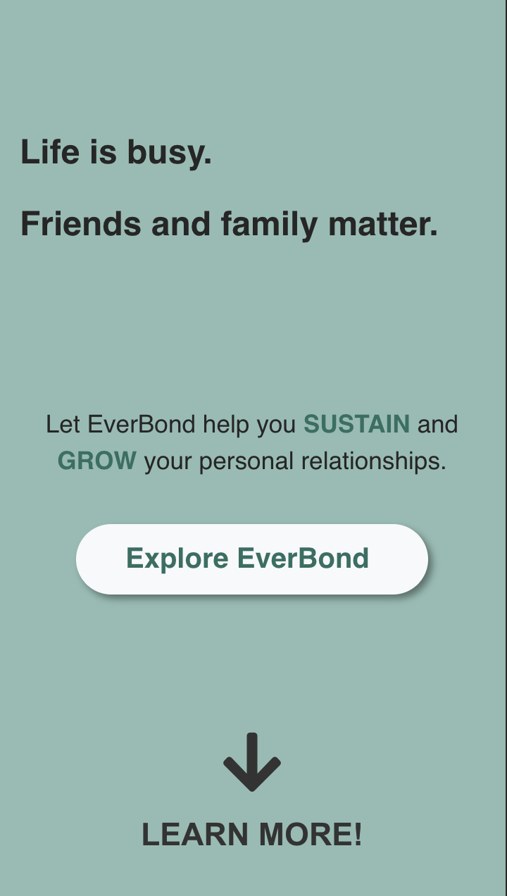
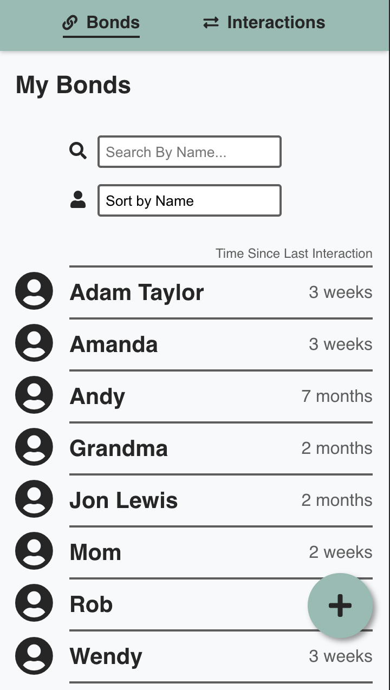
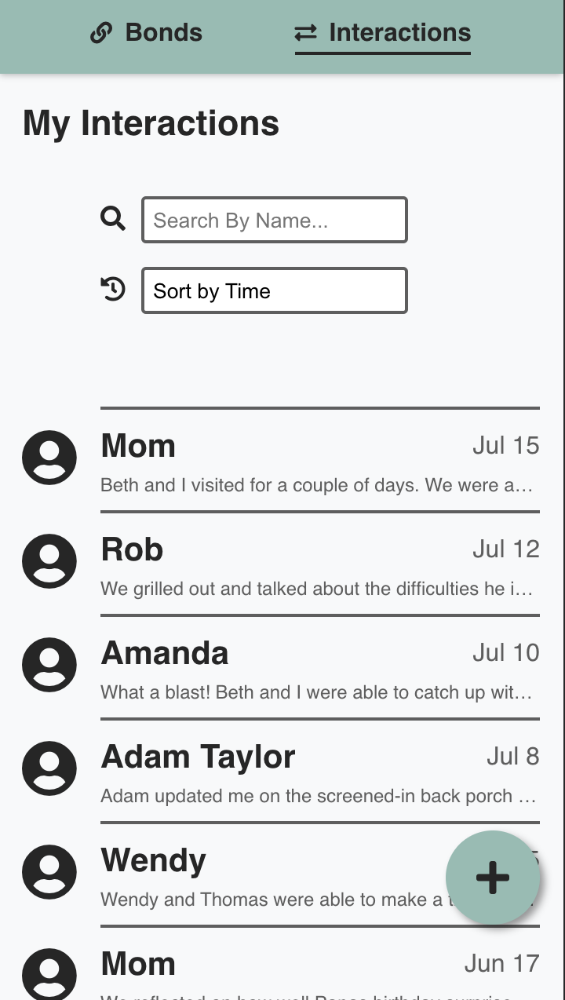

# EverBond API

## Resources

There are two main resources accessible through the EverBond API:

1) Bonds
2) Interactions

An example bond:
> { 
  id: 3 , 
  name: 'Grandma' , 
  birthday: '02/18' , 
  notes:
    'Loves to get hand written letters. Also enjoys Facebook messages.' , 
}

An example interaction:
> { 
  id: 7 , 
  bondId: 1 , 
  date: '2020-06-17' , 
  medium: 'Phone Call' , 
  location: '' , 
  description:
  "We reflected on how well Papa's birthday surprise went over." , 
}
## Available Endpoints

### Base URL : `'http//sleepy-bastion-27432.herokuapp.com'`

### Route: `/bonds`

* `GET '/bonds'`
* `POST '/bonds'`

### Route: `/bonds/:bondId`

* `GET '/bonds/:bondId'`
* `PATCH '/bonds/:bondId'`

### Route: `/interactions`

* `GET '/interactions'`
* `POST '/interactions'`

### Route: `/interactions/:interactionId`

* `GET '/interactions/:interactionId'`
* `PATCH '/interactions/:interactionId'`

## Scripts

Start the application `npm start`

Start nodemon for the application `npm run dev`

Run the tests `npm test`

 
 

# EverBond
* [live app](https://everbond.now.sh)

## Summary

EverBond is a web app which provides a simple and effective way to sustain and grow your personal relationships.

Everbond helps you prevent relational decay by providing a place to record and review your interactions with friends and family. For example, you can easily track how long it's been since you last called Grandma. And you can quickly review notes from your last conversation to gather potential talking points or follow-up questions for an upcoming interaction.

In essence, EverBond is your personal assistant to empower you to follow through on your good intentions to remain connected to your friends and family.

More information on how Everbond works can be found on the app's [landing page](https://everbond.now.sh). There you will also find a couple of brief videos demonstrating the app.

## Screenshots

**Landing Page:**

   

**My Bonds:**

   

**My Interactions:**

   

## Technical Requirements

* Uses React, Node, Express, and PostgreSQL.
* The client and API are deployed separately and stored in separate GitHub repos. (The GitHub for the API can be found [here](https://github.com/caleb-king/everbond-server))
* Uses a responsive and mobile-first design.
* Uses semantic HTML/JSX.
* Uses vanilla CSS for styling.
* Both client- and server-side code is tested.
* Includes a landing page that explains what the app does and how to get started.
* Is live and publicly-accessible.
* Follows a11y best practices.
* Works across different browsers. (Chrome, Firefox, and Safari)
